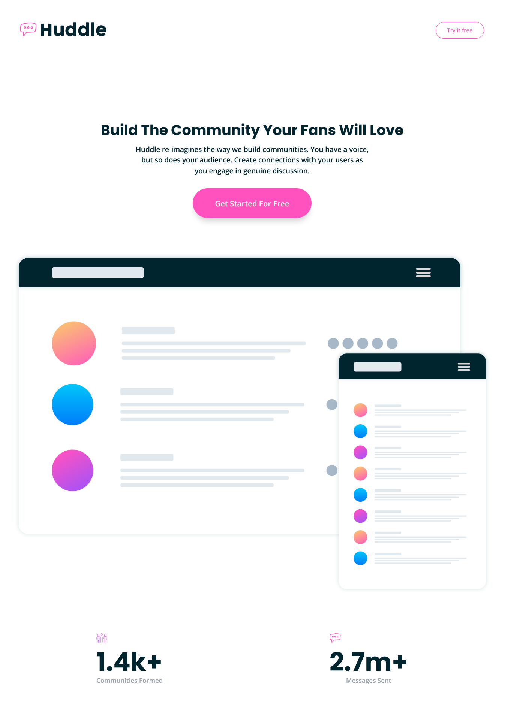

# Frontend Mentor - Huddle landing page with curved sections solution

This is a solution to the [Huddle landing page with curved sections challenge on Frontend Mentor](https://www.frontendmentor.io/challenges/huddle-landing-page-with-curved-sections-5ca5ecd01e82137ec91a50f2). Frontend Mentor challenges help you improve your coding skills by building realistic projects.

## Table of contents

- [Overview](#overview)
  - [The challenge](#the-challenge)
  - [Screenshot](#screenshot)
  - [Links](#links)
- [My process](#my-process)
  - [Built with](#built-with)
  - [What I learned](#what-i-learned)
  - [Continued development](#continued-development)
  - [Useful resources](#useful-resources)
- [Author](#author)
- [Acknowledgments](#acknowledgments)

## Overview

### The challenge

Users should be able to:

- View the optimal layout for the site depending on their device's screen size
- See hover states for all interactive elements on the page

### Screenshot

### Links

- Solution URL: [Add solution URL here](https://github.com/talentlessDeveloper/huddle-landing-page)
- Live Site URL: [Add live site URL here](https://talentlessDeveloper.github.io/huddle-landing-page)

## My process

### Built with

- Semantic HTML5 markup
- CSS custom properties
- Flexbox

### What I learned

I used html figure tag for the first time, learned that adding viewbox makes it easy in adjusting width and height of svg elements.

### Continued development

My use of helper classes needs to improve, following css best practices too

### Useful resources

- [Example resource 1](https://www.stackoverflow.com) - Stackoverflow saves lives.

## Author

- Website - [Add your name here](https://www.your-site.com)
- Frontend Mentor - [@talentlessDeveloper](https://www.frontendmentor.io/profile/talentlessDeveloper)
- Twitter - [@kcreeem](https://www.twitter.com/kcreeem)

## Acknowledgments

Bigups to frontend mentor and to everyone out there that has contributed to community through videos, articles and replies to various questions, you guys are heroes!
